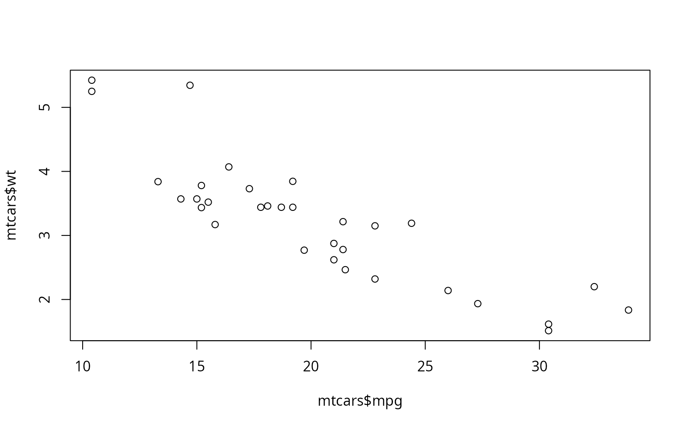

## Verborgene Schätze: Das ungenutzte Wissen in Kommunikationsdaten

In unserer zunehmend digitalisierten Welt entstehen täglich riesige Datenmengen, die Unternehmen Zugang zu einem beachtlichen Wissensschatz bieten. Besonders Kommunikationsdaten sind durch die fortschreitende Digitalisierung rasant gewachsen und eröffnen Unternehmen neue, wertvolle Informationsquellen. Mit diesen Daten lassen sich fundierte Entscheidungen schneller treffen, Kundenbedürfnisse besser verstehen und Prozesse sowie Produkte gezielt optimieren. Zudem erspart die Automatisierung solcher Textanalysen erheblich Zeit, sodass Ressourcen effizienter genutzt werden können. Tagtäglich sammeln Unternehmen eine Vielzahl interner Textdaten, wie elektronische Personalakten, Produktbeschreibungen und Support-Tickets. Hinzu kommt eine Flut an externen Daten aus sozialen Medien, Online-Bewertungen und Nachrichten. Obwohl diese Daten ein enormes Potenzial für die Informationsgewinnung bieten, bleiben sie oft ungenutzt. Der Grund? Sie sind unstrukturiert und wirken dadurch auf den ersten Blick schwieriger auszuwerten. Während numerische Daten geordnet in Datensätzen vorliegen, sind Textdaten wie E-Mails oder Kundenrezensionen weniger zugänglich und komplexer zu analysieren. Für viele Unternehmen sind diese wertvollen Datenquellen zwar vorhanden, werden aber nicht systematisch erfasst. Dadurch geht ein enormer Wissensschatz verloren, der vielfältig genutzt werden könnte -- sei es zur Verbesserung von Kundenservice, zur Innovation von Produkten oder zur Optimierung interner Abläufe.

<details class="code-fold">
<summary>Code</summary>

``` r
plot(mtcars$mpg, mtcars$wt)
```

</details>



## Von Chaos zu Klarheit: Wie Sie aus unstrukturierten Daten Wissen schöpfen

Unstrukturierte Textdaten sind zwar eine Herausforderung, aber auch eine Quelle wertvoller Erkenntnisse. Unternehmen können dieses Potenzial heben, indem sie auf spezialisierte Techniken und Methoden zurückgreifen, die unstrukturierte Texte in aussagekräftiges Wissen umwandeln. Anders als numerische Daten erfordern Textdaten besondere Analysewerkzeuge. Hier kommt die automatisierte Textanalyse -- auch bekannt als Natural Language Processing (NLP) -- ins Spiel, die es Computern ermöglicht, natürliche Sprache zu erkennen und zu verarbeiten.
Zusammen mit Text Mining, einem interdisziplinären Feld, das Informatik, Statistik und Linguistik vereint, bildet NLP einen leistungsfähigen Werkzeugkasten. Text Mining verwendet computergestützte Verfahren, um aus unstrukturierten Texten relevante Informationen und Muster zu extrahieren. Wie der Begriff „Mining" (Bergbau) andeutet, werden Texte dabei „durchforstet", um wertvolle Zusammenhänge und Erkenntnisse zu gewinnen -- ähnlich wie bei der Suche nach Rohstoffen im Boden.
Durch moderne Algorithmen und NLP-Methoden lassen sich unstrukturierte Daten in geordnete, leicht analysierbare Informationen umwandeln. So wird aus einer unübersichtlichen Datenmenge ein fundiertes Wissensfundament, das strategisch genutzt werden kann.

# Strategische Vorteile durch Textdaten

Warum sollten Unternehmen die Analyse von Textdaten in Angriff nehmen, auch wenn sie spezielle Methoden erfordert? Textdaten beinhalten verborgene Informationen, die Unternehmen einen entscheidenden Vorteil in einem wettbewerbsintensiven Markt verschaffen können.
Konkreter können KMUs durch den Einsatz von Text Mining und Natural Language Processing (NLP) folgende Potenziale ausschöpfen, die entsprechende Vorteile verschaffen:

-   Automatische Kategorisierung von Kundenanfragen: Anliegen können schneller und gezielter bearbeitet werden, was die Kundenzufriedenheit und damit auch die Kundenbindung nachhaltig steigert.
-   Produktentwicklung und Innovation: Durch die Analyse von Rezensionen und Feedback lassen sich wertvolle Einblicke in Bedürfnisse und Probleme von Kunden gewinnen, die als Basis für Produktentwicklung und Innovation dienen.
-   Effektive Kundensegmentierung: Unternehmen können Kunden basierend auf Anfragen und Kaufhistorien in Segmente unterteilen und dadurch maßgeschneiderte Kampagnen entwickeln, um Cross- und Upselling-Potenziale zu maximieren.
-   Früherkennung von Trends und Marktveränderungen: Die Analyse aktueller Daten, z.B. von Social Media, ermöglicht es, frühzeitig auf Chancen zu reagieren und sich Wettbewerbsvorteile zu sichern. Gerade durch die frühzeitige Identifikation von neuen Trends auf sozialen Medien besteht ein großes Potenzial vor allem jüngere Generationen mitzureißen.
-   Optimierung interner Prozesse: Bestehende Probleme lassen sich automatisiert erkennen und beheben -- etwa durch die Analyse von Daten, die im Qualitätsmanagement anfallen, wie Prüfberichte oder Fehlermeldungen, wodurch Prozesse optimiert werden können.
-   Überwachung der Markenreputation und zielgerichtete Marketingmaßnahmen: Kundenfeedback und Online-Bewertungen können genutzt werden, um das Markenimage zu beobachten und gezielte Marketingstrategien zu entwickeln.
-   Wettbewerbsanalyse: Ein umfassender Überblick über die Aktivitäten und Entwicklungen von Mitbewerbern hilft, frühzeitig auf Marktveränderungen zu reagieren und sich strategisch zu positionieren.

# Datenquellen im Überblick: Wo sich verborgene Informationen verbergen

Grundsätzlich kann man zwischen zwei Hauptquellen an Textdaten unterscheiden: interne und externe Textdaten. Beide Arten umfassen unterschiedliche Informationen und bieten vielseitige Potenziale für Unternehmen. Hier ein kurzer Überblick über die wichtigsten Datenquellen und deren Nutzen:
Interne Textdaten
Diese Daten werden innerhalb des Unternehmens generiert und bieten wertvolle Einblicke in betriebliche Abläufe und die Kundenkommunikation.
• Kundenkommunikation: Anfragen, Probleme und Empfehlungen, die über E-Mails, Chatbots, Live-Chats, Kundenservicetickets o.Ä. eingehen.
• Kundenbefragungen: Antworten aus Umfragen, die direkte Kundenmeinungen und -wünsche widerspiegeln.
• Unternehmensinterne Kommunikation: E-Mails, Chat- und Meetingprotokolle, Projektberichte und andere interne Dokumentationen.
• CRM-Systeme: Dokumentation von Kundeninteraktionen und -historie, die zur gezielten Ansprache und Kundenbindung genutzt werden können.
• Qualitätsmanagement-Daten: Protokolle und Berichte, die die Produkt- und Prozessqualität sicherstellen und Verbesserungspotenziale aufzeigen.
Externe Textdaten
Diese Daten stammen aus externen Quellen und helfen Unternehmen, zum Beispiel die Außenwahrnehmung zu analysieren und Markttrends zu erkennen.
• Kundenbewertungen: Produkt- und Servicebewertungen auf Plattformen wie Google, Amazon und mehr.
• Social Media-Daten: Posts, Kommentare und Nachrichten von Kunden auf Plattformen wie Facebook, Instagram, Twitter usw.
• Nachrichten, Presseartikel und Blog-Beiträge: Berichte über das Unternehmen, die in den Medien oder in Fachblogs veröffentlicht werden.

Sicher und gesetzeskonform: Was KMUs bei der Datenanalyse beachten müssen
Wenn Unternehmen Textdaten und generative KI-Methoden zur Analyse verwenden, müssen sie bestimmte rechtliche Aspekte beachten, um Compliance und Datenschutz sicherzustellen. Laut dem EU AI Act, der am 1. August 2024 verabschiedet wurde, werden KI-Systeme je nach Risikostufe reguliert (hoch, mittel, niedrig oder kein Risiko). Hochrisiko-KI-Anwendungen, wie solche, die sensible persönliche Daten verarbeiten, erfordern strikte Einhaltung von Transparenz- und Datenschutzrichtlinien und verbieten Emotionserkennung, Manipulation und Social Scoring. Bei mittlerem Risiko, etwa bei Chatbots, sind Transparenzhinweise erforderlich, während Systeme mit geringem Risiko weniger Vorgaben haben -- ein Verhaltenskodex (Code of Conduct) wird jedoch empfohlen. Die offizielle Webseite des EU AI Acts bietet auch einen „Compliance Checker" an, mit dem man durch ein paar Klicks die relevanten Informationen für das eigenen Unternehmen gebündelt aufgelistet bekommt.
Zusätzlich ist die DSGVO bei der Verarbeitung personenbezogener Daten zu beachten. Die Grundsätze der DSGVO, wie Rechtmäßigkeit, Zweckbindung, Transparenz, Datenminimierung und Richtigkeit, müssen eingehalten werden. Personenbezogene Daten, die jede Information umfassen, die eine Person identifizierbar macht (z. B. Namen, IDs oder kombinierte Datenpunkte), sollten pseudonymisiert oder verschlüsselt und nur so lange gespeichert werden, wie sie für den Verarbeitungszweck notwendig sind. Zur Identifizierung solcher personenbezogenen Daten existiert eine Methode namens Named Entity Recognition, für die eine nähere Vorstellung im Methodenreiter existiert. Schließlich sollten auch Urheberrechtsgesetze berücksichtigt werden, insbesondere bei der Verwendung von externen Daten, um Verletzungen des geistigen Eigentums zu vermeiden.

Machen Sie das Beste aus Ihren Kommunikationsdaten
Die Chancen, die sich durch die Analyse von Kommunikationsdaten ergeben, sind vielfältig -- von tieferem Kundenverständnis über Prozessoptimierungen bis hin zur Innovationsförderung. Doch welche Methoden eignen sich am besten, um die wertvollen Einblicke in Ihren Textdaten zu entdecken? In unserem Methoden-Bereich stellen wir Ihnen leistungsstarke Analysetechniken wie Sentimentanalyse, Topic Modeling und Named Entity Recognition vor. Erfahren Sie, wie diese Methoden speziell auf die Bedürfnisse Ihres Unternehmens zugeschnitten werden können und welche davon Ihre Ziele am besten unterstützen. Werfen Sie einen Blick in unseren Methodenbereich und entdecken Sie, wie
