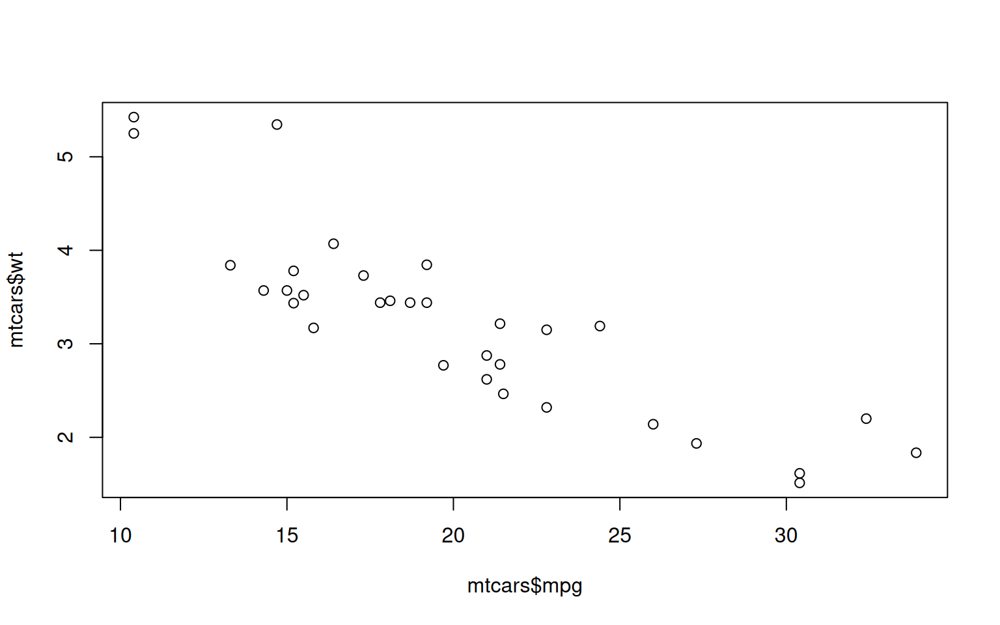

## Einleitung

Sentimentanalyse ist ein Verfahren der Data Science, das darauf abzielt, Meinungen, Emotionen und Einstellungen in Textdaten automatisch zu identifizieren und zu klassifizieren. Unternehmen setzen Sentimentanalyse häufig ein, um Kundenfeedback aus sozialen Medien, Rezensionen oder Umfragen zu analysieren. So können sie wertvolle Einblicke in Bereiche wie die Kundenzufriedenheit oder Markttrends gewinnen.

<details class="code-fold">
<summary>Code</summary>

``` r
plot(mtcars$mpg, mtcars$wt)
```

</details>



## Lexikonbasierte Sentimentanalyse

### Funktionsweise

Die lexikonbasierte Sentimentanalyse ist die traditionelle Form des Verfahrens, bei der vorab definierte Wörterlisten, sogenannte Sentimentlexika, verwendet werden, um die Stimmung eines Textes zu bestimmen. Diese Lexika enthalten Wörter, die mit positiven oder negativen Gefühlen assoziiert sind, oft mit einem entsprechenden Gewicht, das die Stärke des Ausdrucks angibt.

Zur Bewertung werden die Wörter des Textes mit den Einträgen des Lexikons (bspw. SentiWS oder German Polarity Clues) abgeglichen. Die aggregierten Gewichte der Wörter aus dem Lexikon geben schließlich die Gesamtstimmung des Textes wieder.

### Vor- und Nachteile

<ul class="fa-ul" style="margin-left: var(--fa-li-margin, 1.5em);">
<li>
<span class="fa-li"><i class='fa-solid fa-thumbs-up text-primary'></i></span>Die lexikonbasierte Sentimentanalyse ist aufgrund ihrer einfachen Implementierung und des geringen Bedarfs an Rechen- und Speicherkapazität besonders für kleine Unternehmen mit begrenzten Ressourcen attraktiv.
</li>
<li>
<span class="fa-li"><i class='fa-solid fa-thumbs-down text-primary'></i></span>Allerdings stößt sie in komplexen Szenarien schnell an ihre Grenzen, da sie Schwierigkeiten hat, den Kontext und die Mehrdeutigkeit von Wörtern korrekt zu erfassen. Eine Phrase wie „nicht schlecht" kann beispielsweise fälschlicherweise als negativ interpretiert werden, obwohl sie im Kontext positiv gemeint ist.
</li>
</ul>
<iframe id="c944c404" scrolling="no" loading="lazy" style="width: 100%; height: 400pt;">
</iframe>
<script>$(document).ready(function(){  $('iframe#c944c404').attr('src', 'https://shiny.dsjlu.wirtschaft.uni-giessen.de/senti_dict/');});</script>
<script>var domains = ['https://shiny.dsjlu.wirtschaft.uni-giessen.de'];iframeResize(  {waitForLoad: false, license: 'GPLv3', checkOrigin: domains},   '#c944c404');</script>

## Machine-Learning-Basierte Sentimentanalyse

### Funktionsweise

Im Gegensatz zu lexikonbasierten Ansätzen bieten vortrainierte Modelle, die auf allgemeinen Sprachmodellen wie BERT (Bidirectional Encoder Representations from Transformers) basieren, eine fortschrittliche Möglichkeit zur Sentimentanalyse. Diese Modelle lernen aus einer Vielzahl von Beispielen und liefern auch in unbekannten Domänen oder bei komplexen sprachlichen Strukturen, wie Sarkasmus, verlässlichere Ergebnisse. Sie sind nicht auf spezifische Lexika angewiesen und können durch Fine-Tuning flexibel an unterschiedliche Anwendungsfälle angepasst werden, was sie besonders leistungsstark und vielseitig macht.

### Ausprobieren

<iframe id="de8fe906" scrolling="no" loading="lazy" style="width: 100%; height: 400pt;">
</iframe>
<script>$(document).ready(function(){  $('iframe#de8fe906').attr('src', 'https://shiny.dsjlu.wirtschaft.uni-giessen.de/senti_trans/');});</script>
<script>var domains = ['https://shiny.dsjlu.wirtschaft.uni-giessen.de'];iframeResize(  {waitForLoad: false, license: 'GPLv3', checkOrigin: domains},   '#de8fe906');</script>
